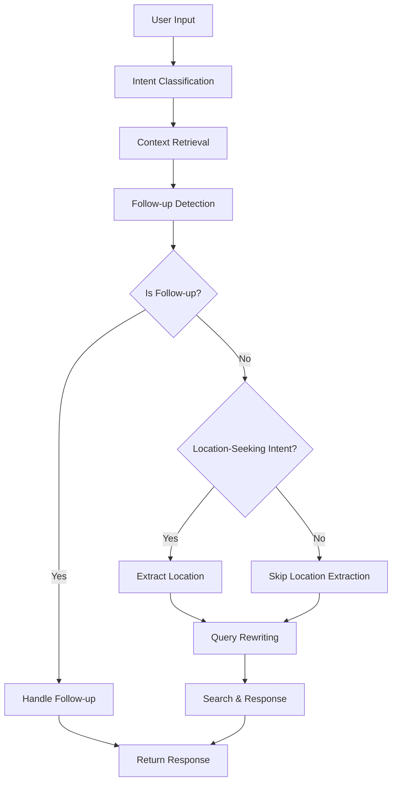

# Relay Server

A Node.js server for handling Twilio voice calls and web requests, providing domestic violence support resources.

**Current Version: 1.22.13** (Updated: January 2025)

---

## 🆕 v1.22.13 Highlights
- **Enhanced "Near Me" Detection**: Improved location detection to properly handle current location phrases
  - **Robust Phrase Matching**: Enhanced detection of "near me", "around me", "close to me", "my location", "here", etc.
  - **Exact Match Handling**: Special handling for exact matches like "me", "near me", "my location", "here"
  - **Length-Based Processing**: Processes longer phrases first to avoid partial matches
  - **Comprehensive Coverage**: Supports multiple variations of current location expressions
  - **Context-Aware Follow-ups**: Enhanced follow-up detection for location mentions in "off_topic" intents
- **Location Follow-up Enhancement**: System now detects when users mention locations in follow-up conversations
  - **Intent-Aware Processing**: Treats location mentions in "off_topic" intents as resource requests when previous context was resource-seeking
  - **Smart Query Rewriting**: Automatically rewrites queries to include location context for resource searches
  - **Seamless Transitions**: Users can naturally mention locations in follow-up conversations without repeating their request
- **Performance Optimizations**: Reduced timeouts and retry counts across services for faster response times
- **TTS Compatibility**: Removed SSML from welcome messages for OpenAI TTS compatibility and improved speed

## 🆕 v1.22.12 Highlights
- **SSML Voice Enhancement**: Implemented Speech Synthesis Markup Language for empathetic, human-like voice responses
- **Empathetic Voice Profiles**: Different voice characteristics for emotional contexts (empathetic, calm, clear, urgent)
- **Natural Conversation Flow**: Strategic pauses and prosody for human-like interaction
- **Multi-Language SSML Support**: Enhanced voice responses in English, Spanish, French, and German
- **Comprehensive Template System**: SSML templates for all response types (emergency, welcome, location, resources, follow-ups, errors)

## 🆕 v1.22.11 Highlights
- **Intent-First Flow Restoration**: Restored proper intent classification and location extraction behavior
- **Processing Pipeline Optimization**: Implemented intent-first approach across all processing pipelines
- **Conditional Location Extraction**: Only extract location for location-seeking intents (`find_shelter`, `legal_services`, `counseling_services`, `other_resources`)
- **Context-Aware Follow-ups**: Enhanced follow-up detection using conversation context
- **Performance Improvements**: Reduced unnecessary API calls and improved response quality
- **New Processing Flow**: Intent → Context → Follow-up detection → Location extraction (only if needed) → Query rewriting → Search → Response

## 🆕 v1.22.10 Highlights
- **Location Validation System**: Uses Nominatim geocoding to validate user-provided locations and prompt for clarification when needed
- **Transcription Validation**: Automatically detects and corrects common speech recognition errors (e.g., "I Station 2" → "Station 2")
- **Speech Monitoring**: Real-time monitoring and analysis tools for speech transcription quality and performance
- **Performance Optimization**: Reduced TTS timeouts and enhanced speech recognition parameters for faster response times
- **Query Rewriting**: Improved to preserve user's original query context and reduce overly generic terms
- **No More Annoying Prompts**: Removed "I didn't hear anything" message that was playing after every response

---

## 🚀 Quick Start

### Prerequisites
- Node.js 18+ 
- npm or yarn
- Twilio account (for voice/SMS features)
- OpenAI API key (for AI responses and TTS)

### Installation
```bash
cd relay-server
npm install
```

### Environment Setup
Create a `.env` file in the relay-server directory:

```env
# Twilio Configuration
TWILIO_ACCOUNT_SID=your_account_sid
TWILIO_AUTH_TOKEN=your_auth_token
TWILIO_PHONE_NUMBER=your_twilio_phone_number

# OpenAI Configuration
OPENAI_API_KEY=your_openai_api_key

# TTS Configuration
TTS_PROVIDER=openai
TTS_VOICE=nova
ENABLE_TTS=true

# Server Configuration
PORT=3000
NODE_ENV=development

# Logging
LOG_LEVEL=info
```

### Running the Server
```bash
# Development mode
npm run dev

# Production mode
npm start

# Run tests
npm test
```

## 🎯 Features

### Core Functionality
- **Intent-First Processing**: Always classify intent before any other processing for optimal efficiency
- **Voice Call Processing**: Handle incoming Twilio voice calls with speech recognition
- **AI-Powered Responses**: Generate contextual responses using OpenAI GPT models
- **TTS-Based Welcome Messages**: Welcome messages are generated using OpenAI TTS for natural, high-quality audio
- **Resource Search**: Find domestic violence shelters and support services using Tavily search
- **Multi-language Support**: Support for English, Spanish, French, and German
- **TTS Integration**: Text-to-speech using OpenAI's TTS service with voice customization
- **Conversation Context**: Maintain conversation state for follow-up questions
- **Emergency Handling**: Immediate 911 guidance for emergency situations

### Enhanced Features
- **Conditional Location Extraction**: Only extract location for resource-seeking intents
- **Context-Aware Follow-ups**: Use conversation context to detect and handle follow-ups
- **Pattern Matching Priority**: Use fast pattern matching before expensive APIs
- **Comprehensive Logging**: Detailed request/response logging with requestId, CallSid, and text tracking
- **Error Handling**: Robust error handling with graceful degradation and fallback responses
- **Performance Monitoring**: Real-time performance tracking and optimization
- **Caching System**: Intelligent caching for API responses and TTS audio
- **WebSocket Support**: Real-time communication for web clients
- **SMS Integration**: Send follow-up messages and resource summaries via SMS

## 🏗️ Architecture Overview

### Intent-First Processing Pipeline

The system follows a structured processing flow to ensure accurate and efficient responses:



### Key Principles

1. **Intent Classification First** - Always determine user intent before any other processing
2. **Conditional Location Extraction** - Only extract location for resource-seeking intents
3. **Context-Aware Follow-ups** - Use conversation context to detect and handle follow-ups
4. **Pattern Matching Priority** - Use fast pattern matching before expensive APIs
5. **Graceful Degradation** - Fallback mechanisms for all critical components

### Location-Seeking Intents

Location extraction is only performed for the following intents:
- `find_shelter` - Domestic violence shelters and safe housing
- `legal_services` - Legal aid and attorney services
- `counseling_services` - Therapy and mental health support
- `other_resources` - General domestic violence resources

## 📡 API Documentation

### Processing Flow

The system uses an **intent-first processing approach** to efficiently handle user queries:

1. **Intent Classification** - Always performed first to determine user intent
2. **Context Retrieval** - Get conversation context for follow-up detection
3. **Follow-up Detection** - Check if query is a follow-up to previous conversation
4. **Conditional Location Extraction** - Only extract location for location-seeking intents
5. **Query Rewriting** - Enhance query based on intent and context
6. **Search & Response** - Generate appropriate response using Tavily or GPT

### Voice Processing

#### POST /twilio/voice/process

Processes voice input and returns TwiML response.

**Request Body:**
```json
{
  "CallSid": "string",
  "SpeechResult": "string",
  "SpeechResultConfidence": "number"
}
```

**Processing Steps:**
1. **Intent Classification** - Classify user intent using GPT-3.5-turbo
2. **Context Check** - Retrieve conversation context for follow-up detection
3. **Follow-up Handling** - If follow-up detected, use context for response
4. **Location Extraction** - Only for location-seeking intents
5. **Query Enhancement** - Rewrite query with intent-specific terms
6. **Response Generation** - Use Tavily search or GPT fallback

**Response:**
- TwiML with TTS-generated audio response
- SMS details if requested
- Follow-up prompts for location if needed

### Web Processing

#### POST /twilio/voice/web

Processes text input for web interface.

**Request Body:**
```json
{
  "speechResult": "string"
}
```

**Processing Steps:**
- Same intent-first flow as voice processing
- Returns text response instead of TwiML

### Intent Classification

#### Available Intents

- `find_shelter` - Shelter and housing requests
- `legal_services` - Legal aid and attorney requests
- `counseling_services` - Therapy and mental health requests
- `emergency_help` - Urgent crisis situations
- `other_resources` - General resource requests
- `general_information` - General questions
- `end_conversation` - Conversation termination
- `off_topic` - Non-domestic violence topics

#### Intent Detection

- **Primary**: GPT-3.5-turbo classification with structured prompts
- **Fallback**: Pattern matching for API failures
- **Confidence**: Calculated based on response quality

### Location Processing

#### Location Extraction Strategy

1. **Pattern Matching** - Fast, cost-effective location detection
2. **Geocoding** - Only for ambiguous cases requiring validation
3. **Context Reuse** - Use previous location from conversation context
4. **Follow-up Handling** - Detect location statements in follow-ups

#### Location Types

- **Complete** - Full location with city/state/country
- **Incomplete** - Partial location requiring clarification
- **Current Location** - "near me" or "my location" requests
- **Follow-up** - Location provided in response to previous request

### Conversation Context

#### Context Management

- **Storage**: In-memory with 15-minute timeout
- **Content**: Intent, location, results, timestamps
- **Follow-up Detection**: Uses context to identify related queries
- **Location Persistence**: Maintains location across conversation

#### Context Structure

```json
{
  "lastQueryContext": {
    "intent": "string",
    "location": "string",
    "results": "array",
    "timestamp": "number",
    "needsLocation": "boolean",
    "lastQuery": "string"
  }
}
```

### Error Handling

#### Fallback Strategies

1. **Intent Classification Failure** - Use pattern matching fallback
2. **Location Extraction Failure** - Prompt user for location
3. **Search Failure** - Use GPT fallback response
4. **Context Loss** - Request user to repeat information

#### Error Responses

- **Voice**: TTS-generated error messages with retry prompts
- **Web**: Text error messages with guidance
- **Logging**: Comprehensive error logging for debugging

## 🛠️ Development Guide

### File Structure

```
relay-server/
├── controllers/
│   └── twilioController.js          # Main voice processing controller
├── lib/
│   ├── intentClassifier.js          # Intent classification and follow-up handling
│   ├── queryHandler.js              # Main query processing pipeline
│   ├── enhancedQueryRewriter.js     # Query rewriting with intent awareness
│   ├── enhancedLocationDetector.js  # Location extraction (conditional)
│   └── response.js                  # Response generation
├── routes/
│   └── twilio.js                    # API endpoints
└── docs/
    └── DEPLOYMENT_GUIDE.md          # Deployment instructions
```

### Core Components

#### 1. Intent Classification (`intentClassifier.js`)

**Purpose**: Classify user intent using AI and pattern matching

**Key Functions**:
- `getIntent(query)` - Primary intent classification
- `handleFollowUp(query, context)` - Follow-up detection and handling
- `updateConversationContext()` - Context management

#### 2. Query Processing (`queryHandler.js`)

**Purpose**: Main processing pipeline following intent-first approach

**Processing Steps**:
1. Intent classification
2. Context retrieval
3. Follow-up detection
4. Conditional location extraction
5. Query rewriting
6. Search and response generation

#### 3. Query Rewriting (`enhancedQueryRewriter.js`)

**Purpose**: Enhance queries based on intent and context

**Features**:
- Intent-specific query enhancement
- Context-aware location handling
- Conversation context integration

#### 4. Location Detection (`enhancedLocationDetector.js`)

**Purpose**: Extract location only when needed

**Strategy**:
- Pattern matching first (fast)
- Geocoding only for ambiguous cases
- Context reuse for follow-ups

### Best Practices

#### 1. Intent-First Processing

**Always classify intent first**:
```javascript
// ✅ Correct
const intent = await getIntent(query);
if (locationSeekingIntents.includes(intent)) {
  const location = await extractLocation(query);
}

// ❌ Incorrect
const location = await extractLocation(query);
const intent = await getIntent(query);
```

#### 2. Conditional Location Extraction

**Only extract location when needed**:
```javascript
// ✅ Correct
const isLocationSeekingIntent = locationSeekingIntents.includes(intent);
if (isLocationSeekingIntent) {
  location = await extractLocation(query);
}

// ❌ Incorrect
location = await extractLocation(query); // Always extracts
```

#### 3. Context-Aware Processing

**Use conversation context for follow-ups**:
```javascript
// ✅ Correct
const context = getConversationContext(callSid);
if (context?.lastQueryContext) {
  const followUp = await handleFollowUp(query, context.lastQueryContext);
  if (followUp) return followUp;
}

// ❌ Incorrect
// Process without checking context
```

#### 4. Pattern Matching Priority

**Use fast pattern matching before expensive APIs**:
```javascript
// ✅ Correct
const location = extractLocationByPattern(query);
if (!location) {
  location = await extractLocationWithAI(query);
}

// ❌ Incorrect
const location = await extractLocationWithAI(query); // Always expensive
```

### Performance Optimizations

#### Efficiency Improvements

- **Intent-First Processing** - Avoid unnecessary location extraction
- **Pattern Matching Priority** - Use fast pattern matching before expensive APIs
- **Context Reuse** - Leverage conversation context to reduce API calls
- **Conditional Processing** - Only perform location extraction when needed

#### API Call Optimization

- **Reduced Geocoding Calls** - Only for ambiguous cases
- **Context-Aware Follow-ups** - Use existing context instead of re-processing
- **Intent-Based Filtering** - Skip location extraction for non-resource intents

### Testing

#### Test Coverage

- Intent classification accuracy
- Location extraction precision
- Follow-up detection reliability
- Context management persistence
- Error handling robustness

#### Test Scenarios

- New resource requests with location
- Follow-up questions without location
- Context-aware location follow-ups
- Non-resource intent processing
- Error condition handling

## 🎤 Welcome Message System

### TTS-Based Welcome Messages
The system now uses OpenAI TTS to generate natural, high-quality welcome messages:

**How it works:**
1. **TTS Generation**: Welcome message text is sent to OpenAI TTS service
2. **Audio File Creation**: Generated audio is saved as an MP3 file in `/public/audio/`
3. **TwiML Response**: Audio is played via `<Play>` verb inside a `<Gather>` for immediate interaction
4. **Fallback**: If TTS fails, system falls back to simple `<Say>` TwiML

**Example TwiML Output:**
```xml
<Response>
  <Gather input="speech" action="/twilio/voice/process" method="POST">
    <Play>/audio/welcome_12345.mp3</Play>
  </Gather>
</Response>
```

**Configuration:**
- Welcome messages are configurable per language in `lib/languageConfig.js`
- TTS voice can be customized via `TTS_VOICE` environment variable
- TTS can be disabled by setting `ENABLE_TTS=false`

### Logging and Debugging
All TTS operations include comprehensive metadata:
- `requestId`: Unique request identifier
- `callSid`: Twilio Call SID
- `textLength`: Length of text being converted
- `textPreview`: First 100 characters of text
- `voice`: TTS voice being used
- `provider`: TTS provider (OpenAI, Polly, etc.)

## 🛡️ Error Handling & Logging

### Enhanced Error Handling
The system implements comprehensive error handling with graceful degradation:

**TTS Pipeline:**
- **TTS Generation Failures**: Falls back to simple `<Say>` TwiML
- **Audio File Creation Failures**: Falls back to `<Say>` TwiML
- **OpenAI API Errors**: Graceful fallback with detailed error logging
- **File System Errors**: Handles audio file creation failures gracefully

**Speech Processing Pipeline:**
- **Context Service Failures**: System continues without context if context service is unavailable
- **Intent Classification Failures**: Falls back to 'general_information' intent
- **Location Extraction Failures**: Continues processing with location prompts
- **Query Rewriting Failures**: Uses original query as fallback
- **Response Generation Failures**: Provides fallback responses with detailed error logging
- **Context Update Failures**: Non-blocking updates with error logging

**Error Logging:**
All errors are logged with complete context:
- `requestId`: Unique request identifier for tracking
- `callSid`: Twilio Call SID for call-specific debugging
- `component`: Specific component that encountered the error
- `stack`: Full stack trace for debugging
- `timestamp`: ISO timestamp for chronological analysis

### Configurable Welcome Messages
Welcome messages are now configurable per language using the language configuration system:
- **Language-Specific**: Welcome messages adapt to the selected language
- **TTS-Enhanced**: Messages are delivered via high-quality TTS audio
- **Consistent Experience**: Messages are consistent with the overall language configuration
- **Easy Customization**: Messages can be easily updated in the language configuration files

## 📡 API Endpoints

### Voice Endpoints
- `POST /twilio/voice` - Handle incoming voice calls (with TTS welcome message)
- `POST /twilio/voice/process` - Process speech input
- `POST /twilio/voice/interim` - Handle interim speech results

### Web Endpoints
- `POST /twilio/web/process` - Process web-based speech input
- `GET /health` - Health check endpoint

### Health Check Endpoints
- `GET /health` - Basic health status
- `GET /health/detailed` - Comprehensive system health
- `GET /health/integrations` - External integration status
- `GET /health/config` - Configuration status
- `GET /health/ready` - Kubernetes readiness probe
- `GET /health/live` - Kubernetes liveness probe
- `GET /health/performance` - Performance metrics

## 📊 Monitoring and Debugging

### Key Metrics

Monitor these metrics to ensure system health:

1. **Intent Classification Accuracy** - Should be >90%
2. **Location Extraction Precision** - Should be >85%
3. **Follow-up Detection Rate** - Should be >80%
4. **Processing Time** - Should be <5 seconds
5. **API Call Reduction** - Should see 30-50% reduction in geocoding calls

### Debugging Tools

1. **Request Logging** - All requests logged with unique IDs
2. **Processing Steps** - Each step logged with timing
3. **Error Tracking** - Comprehensive error logging
4. **Context Inspection** - Conversation context debugging

### Common Issues

1. **Intent Misclassification** - Check intent prompts and fallback patterns
2. **Location Extraction Failures** - Verify pattern matching and geocoding
3. **Follow-up Detection Issues** - Check context management and patterns
4. **Performance Degradation** - Monitor API call frequency and timing

## 🚀 Deployment

### Environment Variables

Ensure these are configured:

```bash
OPENAI_API_KEY=your_openai_key
TAVILY_API_KEY=your_tavily_key
TWILIO_ACCOUNT_SID=your_twilio_sid
TWILIO_AUTH_TOKEN=your_twilio_token
```

### Performance Optimization

1. **Caching** - Implement caching for frequently requested data
2. **Rate Limiting** - Configure appropriate rate limits
3. **Monitoring** - Set up comprehensive monitoring
4. **Scaling** - Plan for horizontal scaling

### Security Considerations

1. **Input Validation** - Validate all user inputs
2. **API Key Security** - Secure API key storage
3. **Error Handling** - Don't expose sensitive information in errors
4. **Rate Limiting** - Prevent abuse and DoS attacks